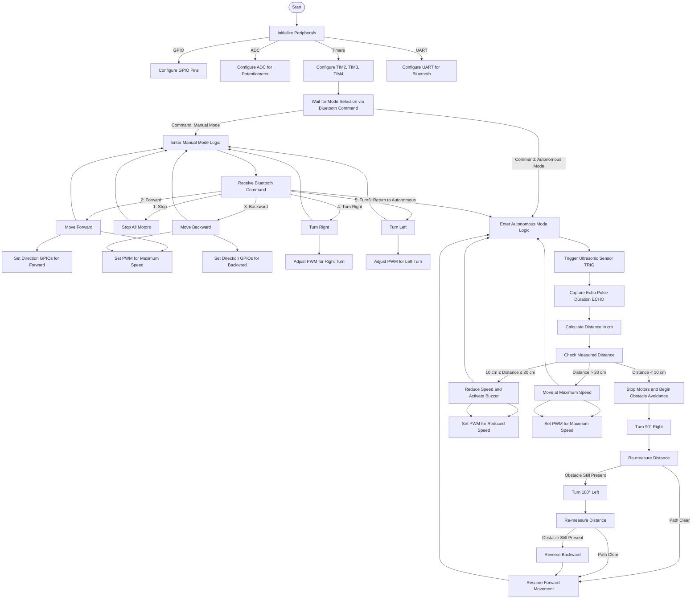

# **STM32L-Discovery Mobile Robot**
This project implements a two-wheeled mobile robot using an STM32L-Discovery board as its control unit. The robot integrates Bluetooth-based manual control, autonomous obstacle avoidance using an ultrasonic sensor, and speed adjustment through a potentiometer. By leveraging STM32's peripherals such as GPIO, ADC, UART, and timers, the robot achieves precise movement, obstacle detection, and user interaction. The primary goal of the project is to demonstrate the capability of embedded systems to manage real-time hardware interactions in a modular and scalable manner.

---

## **📋 Table of Contents**
- 🚀 [Introduction](#-introduction)
   - 💡 [Key Features](#-key-features)
- 🛠  [Implementation Details](#-implementation-details)
   - 💾 [Components](#-components)
   - ⚙️ [Peripheral Configuration and Functionality](#-peripheral-configuration-and-functionality)
   - 🔄 [Program Flow](#-program-flow)
   - 📊 [Flowchart Representation](#-flowchart-representation)
- 📌 [How to Use](#-how-to-use)
   - ⚡ [Hardware Requirements](#-hardware-requirements)
   - ⚙️ [Setup](#-setup)
   - 🔵 [Bluethood Commands](#-bluethood-commands) 

---

## 🚀 **Introduction** 

Microprocessor technology has revolutionized modern embedded systems by enabling compact, efficient, and powerful control solutions for a wide range of applications. This project leverages an STM32L-Discovery board, powered by an ARM Cortex-M3 processor, to implement a two-wheeled mobile robot. The STM32 microcontroller provides advanced features such as integrated timers, ADC, UART, and GPIO, which are utilized to achieve precise motor control, obstacle detection, and real-time decision-making. This robot demonstrates the seamless integration of hardware and software to create an intelligent, versatile platform for robotics.

### 💡 Key Features

- **Dual Operation Modes**: Manual control via Bluetooth or autonomous navigation using an ultrasonic sensor.
- **Speed Control**: Adjusts motor speed dynamically through a potentiometer connected to an ADC channel..
- **Obstacle Avoidance**: Detects and responds to obstacles with real-time feedback using an ultrasonic sensor and execute appropriate maneuvers based on proximity.
- **Auditory Feedback**: A buzzer provides proximity-based sound alerts, with patterns indicating proximity to obstacles..
- **Efficient Hardware Use**: Combines modular firmware and minimal components for robust performance, since is esigned to maximize functionality while minimizing the number of components.

---

## 🛠 **Implementation Details**

### 💾 **Components**  

1. **STM32L-Discovery Board**  
   - **Description**: The core of the project, featuring an STM32L152 microcontroller based on an ARM Cortex-M3 processor. It provides integrated peripherals like GPIO, timers, ADC, and UART for efficient hardware control.  
   - **Connections**:  
     - **Bluetooth Module**: Connected via UART (TX: PA9, RX: PA10).  
     - **Ultrasonic Sensor (HC-SR04)**:  
       - Trigger: PD2 (GPIO output).  
       - Echo: PA5 (input capture via TIM2).  
     - **Motors**:  
       - Right Motor PWM: PB8 (TIM4-CH3).  
       - Right Motor Direction: PA11 (GPIO output).  
       - Left Motor PWM: PB9 (TIM4-CH4).  
       - Left Motor Direction: PA12 (GPIO output).  
     - **Potentiometer**: Connected to PA4 (ADC input) for speed control.  
     - **Buzzer**: Connected to PA1 (GPIO output) for sound alerts.  

2. **Bluetooth Module (e.g., HC-05)**  
   - **Functionality**: Enables wireless communication for manual control of the robot.  
   - **Connection**: UART interface (TX: PA9, RX: PA10).  

3. **Ultrasonic Sensor (HC-SR04)**  
   - **Functionality**: Measures distance to obstacles.  
   - **Connection**:  
     - Trigger (TRIG): PD2 (GPIO output).  
     - Echo (ECHO): PA5 (TIM2 input capture).  

4. **Motors with H-Bridge Driver**  
   - **Functionality**: Controls robot movement through PWM signals for speed and GPIO for direction.  

5. **Potentiometer**  
   - **Functionality**: Adjusts motor speed dynamically.  
   - **Connection**: PA4 (ADC input).  

6. **Buzzer**  
   - **Functionality**: Provides auditory feedback based on proximity to obstacles.  
   - **Connection**: PA1 (GPIO output).  

--- 

### ⚙️ **Peripheral Configuration and Functionality**

1. **Timers**  
   - **TIM2**:  
     - **Mode**: Input capture for ultrasonic sensor echo signal.  
     - **Purpose**: Measures echo pulse duration for distance calculation.  
   - **TIM3**:  
     - **Mode**: Output compare.  
     - **Purpose**: Controls buzzer for intermittent alerts and manages timed delays for obstacle avoidance.  
   - **TIM4**:  
     - **Mode**: PWM.  
     - **Purpose**: Generates PWM signals for precise motor speed control.  

2. **GPIO**  
   - Configured for input/output functions:
     
     **GPIO Outputs:**  

     - **_PA1_**:  
       - **Functionality**: Controls the buzzer for auditory feedback.  
       - **Usage**:  
         - High state (logic 1): Turns the buzzer off (active low).  
         - Low state (logic 0): Turns the buzzer on.  
       - **Purpose**: Provides sound alerts based on proximity to obstacles in autonomous mode.  

     - **_PA11_ and _PA12_**:  
       - **Functionality**: Control the direction of the motors.  
       - **Usage**:  
         - **PA11**: Right motor direction.  
         - **PA12**: Left motor direction.  
         - High state (logic 1): Motor moves backward.  
         - Low state (logic 0): Motor moves forward.  
       - **Purpose**: Allows the robot to navigate forward, backward, and turn by reversing motor directions.
         
     - **_PB8_ and _PB9_**:  
       - **Functionality**: Provide PWM signals for motor speed control.  
       - **Usage**:  
         - **PB8 (TIM4-CH3)**: Right motor speed control.  
         - **PB9 (TIM4-CH4)**: Left motor speed control.  
         - Duty cycle varies based on potentiometer input or distance to obstacles.  
       - **Purpose**: Adjust motor speeds dynamically for smooth navigation and obstacle avoidance.
         
     - **_PD2_**:  
       - **Functionality**: Trigger pin for the ultrasonic sensor (HC-SR04).  
       - **Usage**:  
         - Generates a high pulse of 10 µs to initiate distance measurement.  
       - **Purpose**: Sends a trigger signal to the ultrasonic sensor to measure the distance to obstacles.  

      **GPIO Inputs**  

      - **PA5**:  
        - **Functionality**: Echo pin for the ultrasonic sensor (HC-SR04).  
        - **Usage**:  
          - Captures the return pulse duration, which corresponds to the distance to the obstacle.  
        - **Purpose**: Measures the time taken by the ultrasonic pulse to return, enabling distance calculation.  

       - **PA4**:  
         - **Functionality**: Reads the potentiometer value via ADC.  
         - **Usage**:  
           - Analog voltage from the potentiometer is converted to a digital value by the ADC.  
         - **Purpose**: Determines the speed of the motors by adjusting the PWM duty cycle.

   - Summary of GPIO connections:
     
    | **Pin** | **Role**                | **Functionality**                   | **Peripheral Usage**       |  
    |---------|--------------------------|-------------------------------------|----------------------------|  
    | PA1     | Buzzer                  | Auditory feedback                   | GPIO Output               |  
    | PA4     | Potentiometer           | Speed control                       | ADC Input                 |  
    | PA5     | Ultrasonic Sensor Echo  | Captures return pulse               | GPIO Input (TIM2 Input Capture) |  
    | PA11    | Right Motor Direction   | Sets motor direction                | GPIO Output               |  
    | PA12    | Left Motor Direction    | Sets motor direction                | GPIO Output               |  
    | PB8     | Right Motor Speed       | Controls speed via PWM              | TIM4-CH3 (PWM Output)     |  
    | PB9     | Left Motor Speed        | Controls speed via PWM              | TIM4-CH4 (PWM Output)     |  
    | PD2     | Ultrasonic Sensor Trigger | Sends a trigger pulse               | GPIO Output               |

3. **ADC**  
   - **Channel**: PA4.  
   - **Purpose**: Reads potentiometer values to dynamically adjust motor speed and determine speed levels in low, medium or high.   
   - **Configuration**: 12-bit resolution, continuous conversion mode.  

4. **UART**  
   - **Configuration**:  
     - Baud rate: 9600.  
     - Data format: 8 data bits, no parity, 1 stop bit.  
   - **Purpose**: Facilitates communication with the Bluetooth module for receiving commands.
     
5. **Ultrasonic Sensor**  
   - Trigger generates a pulse via PD2.  
   - Echo measures the return time of the pulse to calculate distance.  

6. **Main Loop** (`while(1)`)  
   - Processes received Bluetooth commands for manual control.  
   - Executes autonomous mode logic using sensor data to adjust speed, avoid obstacles, and provide sound feedback.

---
  
### 🔄 **Program Flow**

_This structured program enables seamless switching between manual and autonomous modes, providing a robust and versatile robotic platform._ 

#### Manual Mode  
1. Commands are sent via Bluetooth.  
2. The UART interrupt receives commands (e.g., forward, backward, stop, etc.).  
3. Commands are processed in the main loop using a `switch` statement.  
4. Motors are controlled based on the received command:  
   - Adjust direction via GPIO pins.  
   - Set speed using PWM signals.  

#### Autonomous Mode  
1. The ultrasonic sensor measures the distance to obstacles.  
2. Logic based on distance:  
   - **> 20 cm**: Move at maximum speed.  
   - **10 – 20 cm**: Reduce speed and activate intermittent buzzer.  
   - **< 10 cm**: Stop and perform obstacle avoidance maneuvers.  
3. Obstacle Avoidance Steps:  
   - Turn 90° right; if still blocked, turn 180° left.  
   - Continue measuring distance until the path is clear.

---

### 📊 **Flowchart Representation**

---

## 📌 **How to Use**

### ⚡ **Hardware Requirements**
- STM32L-Discovery Board.
- Ultrasonic Sensor (HC-SR04).
- Potentiometer (preferably not multi-turn).
- Motors and H-Bridge Driver.
- Bluetooth Module (HC-05).
- Power Supply.
- Male-female and female-female cables

### 🔧 **Setup**

1. Connect the components to the STM32 board as per the pin configuration.
2. Flash the firmware to the STM32 board using STM32CubeIDE and configure all the pins before creating the project.
3. Power up the robot.

### 🔵 **Bluethood Commands**

 | **Command** | **Fuction**          |
 |-------------|----------------------|
 | 1           | Stop                 |
 | 2           | Move Forward         |
 | 3           | Move Backward        |
 | 4           | Turn Right           |
 | 5           | Turn Left            |
 | 6           | Autonomous Mode      |
 
